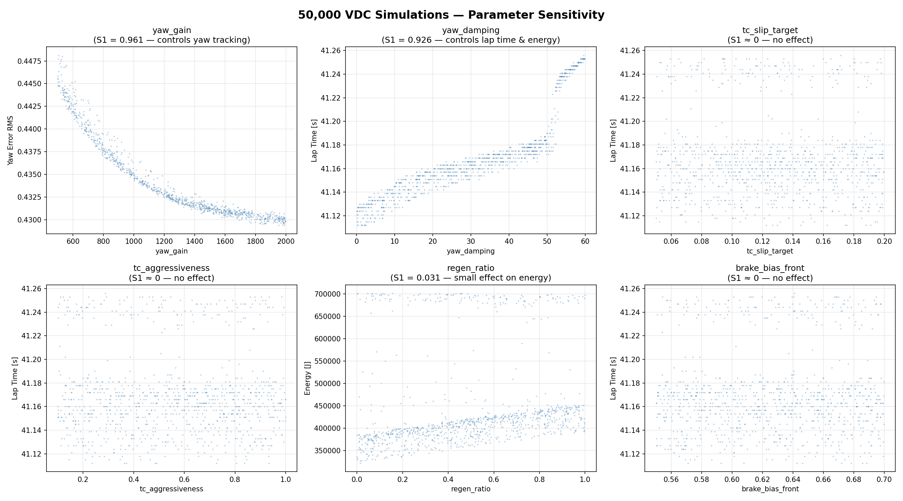
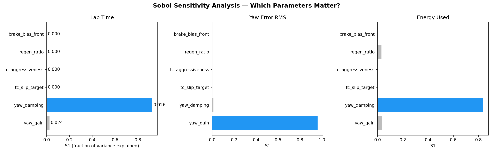
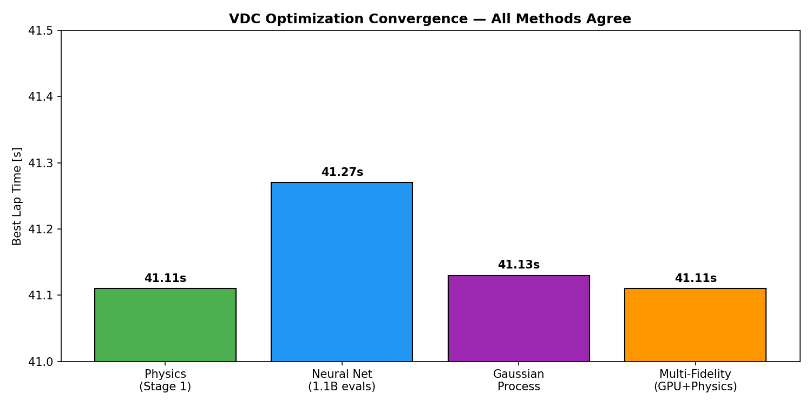
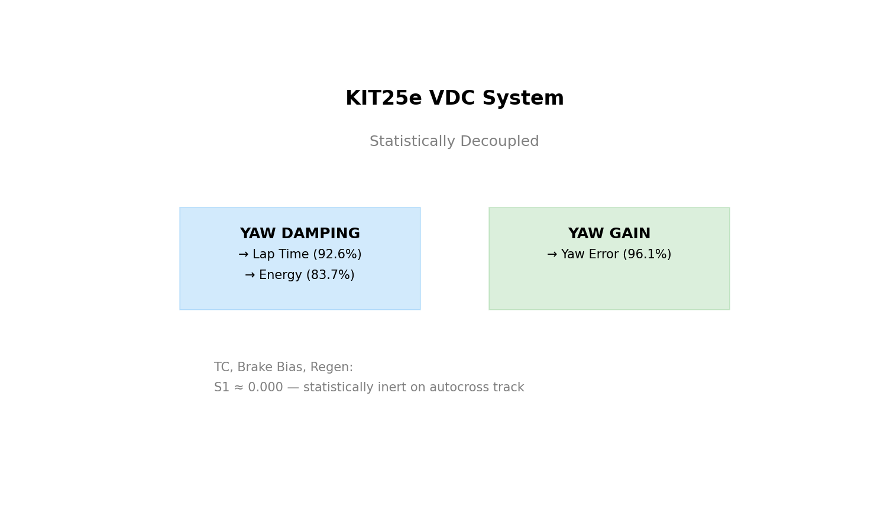
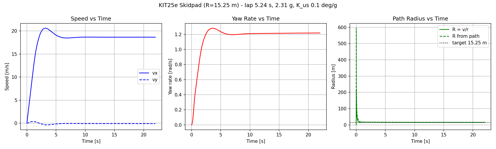
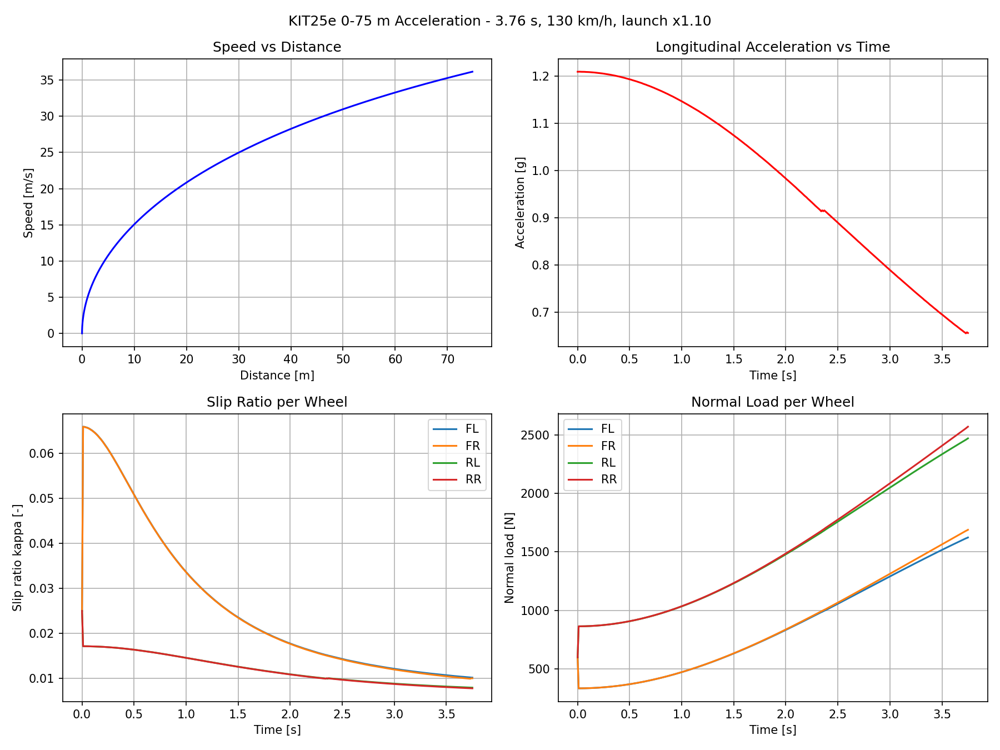
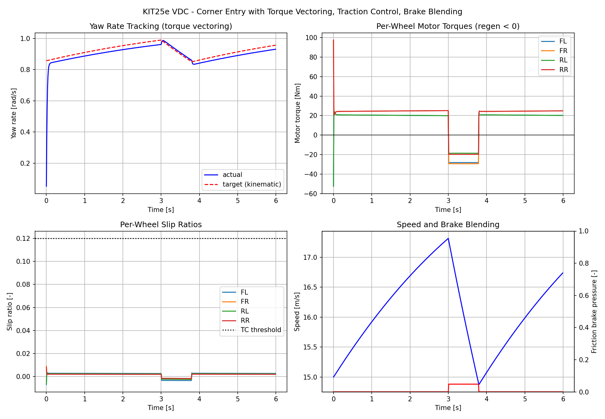
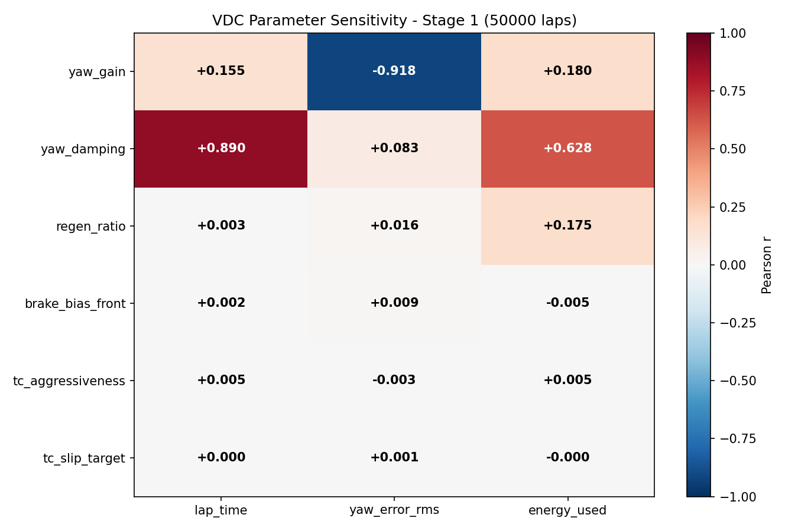

# Robust VDC Calibration for Formula Student Vehicles

**HPC-based vehicle dynamics optimization framework validated against publicly available KIT25e specifications and FSG 2025 performance data.**

---

## The Problem

Formula Student teams combine simulation, engineering experience, and track testing to calibrate VDC systems. However, the calibration parameter space is too large for exhaustive manual exploration, and setups optimized for ideal conditions often degrade under competition variability.

## What This Framework Does

1. **Physics-based KIT25e reference model** with Pacejka MF5.0 tire modeling and vehicle-level validation against public FSG performance metrics
2. **HPC-scale simulation** — 50,000+ physics laps in under an hour on cluster CPUs
3. **Neural network surrogate** — predicts VDC performance in microseconds, enabling billion-scale surrogate-model parameter-space exploration
4. **Robust optimization** — finds calibrations that work across grip and driver variation, not just ideal conditions

## Key Results

| Method | Scale | Result |
|--------|-------|--------|
| Latin Hypercube sweep | 50,000 physics simulations | Dominant sensitivity in yaw-control parameters; longitudinal VDC parameters showed limited effect in the current lateral-dynamics-focused autocross model |
| Surrogate model ensemble | 1,100,000,000 virtual evaluations | yaw_gain ~1500 Nm/(rad/s), yaw_damping = 60 Nm/(rad/s²) |
| Robustness sweep | 1,400,000 physics laps across 7 scenarios | Optimal calibration validated under grip/driver variation |

## Optimal VDC Calibration

Yaw gain definition: `K_yaw` = yaw moment command gain [Nm/(rad/s)]  
Yaw damping definition: `D_yaw` = yaw acceleration damping [Nm/(rad/s²)]

| Parameter | Value | Unit | Importance |
|-----------|-------|------|------------|
| yaw_gain | ~1500 | Nm/(rad/s) | Explains 96.1% of yaw-error variance in explored parameter space |
| yaw_damping | 60 (max) | Nm/(rad/s²) | Explains 92.6% of lap-time and 83.7% of energy variance |
| tc_slip_target | ~0.08 | slip ratio | Limited influence in current lateral-dynamics-focused simulation |
| tc_aggressiveness | ~0.17 | gain factor | Limited influence |
| regen_ratio | ~0.97 | fraction | Minor energy effect (3.1%) |
| brake_bias | ~0.58 | front fraction | Limited influence |

**Note:** yaw_damping optimum reached upper search boundary; this result should be interpreted as a boundary indication rather than a final optimum; further range expansion may yield additional improvement. The current autocross simulation is primarily lateral-yaw limited; longitudinal VDC parameters may show greater influence on endurance or mixed acceleration/braking sections.

## Validation Against Public FSG 2025 Performance Data

| Test | KIT25e Actual | Model | Error |
|------|---------------|-------|-------|
| Skidpad (R=15.25m) | 5.14s | 5.20s | +1.2% |
| Acceleration 0-75m | 3.57s | 3.76s | +5.3% |

## Hardware Used

All computation runs on a shared academic cluster available at zero cost:

| Resource | Used | Duration |
|----------|------|----------|
| CPU nodes (Intel Xeon Gold 6338) | 792 cores | ~8 hours |
| Total CPU core-hours | ~6,300 core-hours | — |
| GPU (NVIDIA V100 16GB) | 1 GPU | <3 minutes total |
| RAM per simulation | ~100 MB | — |

The framework scales from a laptop to any Slurm-based cluster.

All optimization experiments are reproducible through fixed random seeds, stored parameter configurations, and containerized environments.

## Quick Start

```bash
# Validate tire model
python3 -c "from src.tire import validate; validate()"

# Run skidpad test
python3 -c "from src.vehicle import skidpad_test; skidpad_test()"

# Run acceleration test
python3 -c "from src.vehicle import acceleration_test; acceleration_test()"

# Test VDC controller
python3 -c "from src.controller import vdc_test; vdc_test()"
```

## Repository Structure

```
├── src/
│   ├── tire.py              # Pacejka MF5.0 tire model
│   ├── vehicle.py           # 3-DOF vehicle dynamics with KIT25e parameters
│   ├── controller.py        # VDC (torque vectoring, TC, brake blending)
│   ├── optimization/         # Surrogate models, Sobol analysis, GP
│   ├── surrogate.py
│   └── robustness.py
└── sweeps/              # HPC sweep infrastructure
├── models/                  # Trained surrogate models (NN + GP)
├── notebooks/               # Analysis and validation notebooks
├── docs/                    # Detailed methodology and results
│   ├── SOBOL_RESULTS.md     # Full Sobol sensitivity analysis
│   ├── SURROGATE_MODELS.md  # Surrogate model architecture and accuracy
│   └── RECOMMENDATION.md    # Final calibration recommendation
├── cfd/                     # OpenFOAM CFD pipeline for future geometry integration
└── containers/              # Apptainer definition files
```

## Methodology

Three independent statistical methods confirm the same result:

1. **Sobol sensitivity analysis** (5,000 bootstrap resamples on 50,000 samples): yaw_damping explains 92.6% of observed lap-time variance within the evaluated parameter space
2. **Gaussian Process with Automatic Relevance Detection**: yaw_damping lengthscale = 0.10, all other parameters > 2.6
3. **Pearson correlation**: consistent ranking across all three performance metrics

## Current Limitations
- Endurance testing (24.9 km with tire degradation) confirmed TC parameters remain inert — the 4WD system with R20 slicks provides sufficient mechanical grip

- Vehicle model uses publicly available specifications — no team telemetry
- Tire model is based on available MF5.0 R20 data, not TTC Round 9 measurements
- Aero parameters estimated from comparable FSAE vehicle data
- Validation uses event-level performance metrics rather than logged vehicle data
- Track layout is representative autocross, not FSG 2025 competition track
- Surrogate model accuracy: RMSE ~0.02s lap time, R² > 0.99 on held-out test set

## Potential Team Applications

With access to team-specific data, this framework can be extended to:

- Validate against logged vehicle telemetry
- Replace estimated parameters with measured values
- Optimize VDC calibrations before test days
- Evaluate calibration robustness across track conditions
- Compare controller strategies for future vehicles

## Reference Vehicle

| Parameter | Value | Source |
|-----------|-------|--------|
| Mass | 176 kg (244 kg with driver) | FSG registration |
| Wheelbase | 1530 mm | FSG registration |
| Track | 1220 mm F/R | FSG registration |
| Powertrain | 4× PMSM hub motors, 29 kW each | FSG registration |
| Tires | Hoosier 16.0×7.5-10 R20 | FSG registration |

## Detailed Documentation

- [Sobol Sensitivity Analysis](docs/SOBOL_RESULTS.md)
- [Surrogate Model Details](docs/SURROGATE_MODELS.md)
- [VDC Calibration Recommendation](docs/RECOMMENDATION.md)
- [CFD Pipeline](cfd/)
- [Endurance Simulation](src/sweeps/endurance.py) — 22km multi-lap with tire degradation

---

Developed as an independent vehicle dynamics research project inspired by Formula Student and the KA-RaceIng KIT25e.

## Key Figures









